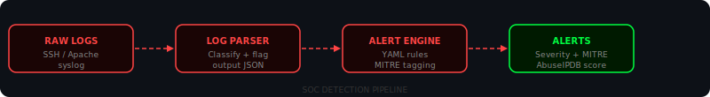
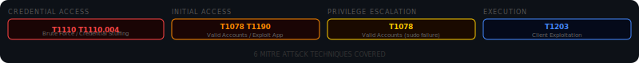
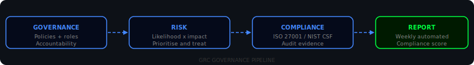
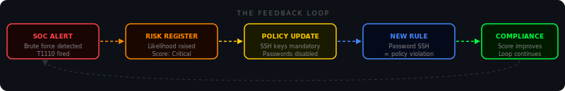

<div align="center">


<br/>


<br/>

[](https://speed-boo3.github.io/soc-grc-project/explain/)

</div>

---

## What this project is

Built as part of a master's in cybersecurity. It covers Security Operations Center work and Governance, Risk and Compliance — two disciplines that most courses teach separately and never connect.

The SOC detects threats in real time. GRC makes sure the right controls exist to prevent them. In practice they feed each other continuously: a SOC alert raises a GRC risk score, a GRC policy creates a new SOC detection rule, a compliance gap becomes a detection engineering task. This project builds both sides and demonstrates the loop between them.

The interactive guide at the link above covers everything from scratch with live animations, a scanner simulation, risk scoring tool and an AI security analyst.

---



## The SOC side

The SOC tools form a pipeline. Raw log files go in. Structured, MITRE-tagged alerts come out.

```bash
python soc/log-parser/generate_logs.py
python soc/log-parser/parser.py --file soc/log-parser/sample.log --output parsed.json
python soc/alert-rules/alert_engine.py --logs parsed.json --rules soc/alert-rules/rules.yaml
```

```
3 alert(s) triggered:

[HIGH] Brute Force Detected (RULE-001)
  MITRE ATT&CK : T1110 - Brute Force (Credential Access)
  Log entry    : Source IP 45.33.32.156 had 9 failed login attempts

[MEDIUM] Sudo Authentication Failure (RULE-003)
  MITRE ATT&CK : T1078 - Valid Accounts (Privilege Escalation)
  Log entry    : pam_unix(sudo:auth): authentication failure uid=1003

[MEDIUM] Segfault Detected (RULE-006)
  MITRE ATT&CK : T1203 - Exploitation for Client Execution (Execution)
  Log entry    : program[4821]: segfault at 0x0 ip 00007f error 4
```

**Log parser** reads raw logs, classifies every line by type and flags suspicious entries.

**Alert engine** runs YAML detection rules against the parsed output. Every rule maps to a MITRE ATT&CK technique so every alert tells you what the attacker is trying to accomplish.

**Brute force detector** uses a sliding time window. A burst of 9 attempts in 60 seconds is treated differently to 9 attempts spread over a week — because attack rate matters more than total count.

**Threat intelligence** checks source IPs against AbuseIPDB. A 97% abuse confidence score changes a suspicious login into a confirmed targeted attack from a known threat actor.

### MITRE ATT&CK coverage



| ID | Technique | Tactic | Rule |
|---|---|---|---|
| T1110 | Brute Force | Credential Access | RULE-001 |
| T1110.004 | Credential Stuffing | Credential Access | RULE-004 |
| T1078 | Valid Accounts | Initial Access | RULE-002 |
| T1078 | Valid Accounts | Privilege Escalation | RULE-003 |
| T1190 | Exploit Public Application | Initial Access | RULE-005 |
| T1203 | Exploitation for Client Execution | Execution | RULE-006 |

---



## The GRC side

GRC answers the questions the SOC cannot: are our controls correct? Can we prove they work? What are our biggest risks right now?

```bash
python grc/risk-assessment/risk_matrix.py --file grc/risk-assessment/sample_risks.json
```

```
Risk Assessment Report
======================================================================
ID         Risk                            Score   Level      Owner
----------------------------------------------------------------------
RISK-002   Phishing attack                  20     Critical   Security Team
RISK-001   Unpatched systems                20     Critical   IT Operations
RISK-005   SQL injection data breach        15     High       Dev Team
RISK-003   Insider threat                   10     High       HR / Security
RISK-004   DDoS attack                       9     Medium     Network Team
RISK-006   Lost or stolen laptop             6     Medium     IT Operations
```

**Risk matrix** scores risks by likelihood x impact, both 1 to 5. The result tells you what to fix first.

**Network scanner** wraps nmap and converts risky open ports into risk register entries. Validates policy against the actual network — the gap between them is where audit findings come from.

**Compliance checklist** covers ISO 27001 and NIST CSF controls in one document.

**Report generator** runs Monday, Wednesday and Friday via GitHub Actions. Results are in `reports/`.

---



## The loop between them

When the SOC detects a brute force attack, that finding goes into the GRC risk register. The likelihood score rises. The security policy is updated — SSH key auth becomes mandatory, password auth disabled. The SOC gets a new detection rule: any password-based SSH attempt is now a policy violation. The weekly GRC report shows the Access Control score improving. Then it starts again.

Every detection improves governance. Every policy creates new rules.

---

## Project structure

```
soc-grc-project/
├── soc/
│   ├── log-parser/
│   │   ├── parser.py               <- classifies log lines, outputs JSON
│   │   └── generate_logs.py        <- generates realistic test logs
│   ├── alert-rules/
│   │   ├── rules.yaml              <- 6 detection rules with MITRE mapping
│   │   ├── alert_engine.py         <- runs logs against the rules
│   │   └── threat_intel.py         <- AbuseIPDB IP reputation lookup
│   ├── brute-force-detector/
│   │   └── detector.py             <- sliding window brute force detection
│   ├── dashboard/
│   │   └── dashboard.py            <- terminal overview
│   └── incident-response/
│       └── playbook.md             <- NIST SP 800-61 based IR procedures
├── grc/
│   ├── risk-assessment/
│   │   ├── risk_matrix.py          <- likelihood x impact scoring engine
│   │   └── sample_risks.json       <- 6 example risk register entries
│   ├── network-scan/
│   │   └── scanner.py              <- nmap wrapper with risk output
│   ├── policies/
│   │   └── security_policy.md      <- full security policy template
│   └── compliance/
│       └── checklist.md            <- ISO 27001 and NIST CSF checklist
├── scripts/
│   └── generate_report.py          <- weekly compliance report
├── reports/                        <- auto-generated reports
├── explain/
│   └── index.html                  <- interactive learning site
└── .github/workflows/
    ├── daily-scan.yml              <- 07:00 UTC daily
    └── weekly-report.yml           <- Mon, Wed, Fri 08:00 UTC
```

---

## Quickstart

```bash
git clone https://github.com/Speed-boo3/soc-grc-project.git
cd soc-grc-project
pip install -r requirements.txt
```

SOC pipeline:
```bash
python soc/log-parser/generate_logs.py
python soc/log-parser/parser.py --file soc/log-parser/sample.log --output parsed.json
python soc/alert-rules/alert_engine.py --logs parsed.json --rules soc/alert-rules/rules.yaml
```

GRC risk scoring:
```bash
python grc/risk-assessment/risk_matrix.py --file grc/risk-assessment/sample_risks.json
```

Tests:
```bash
pytest tests/ -v
```

---

## Learn more

- [MITRE ATT&CK](https://attack.mitre.org) — technique and tactic library
- [NIST SP 800-61](https://csrc.nist.gov/publications/detail/sp/800-61/rev-2/final) — incident handling guide
- [ISO 27001](https://www.iso.org/isoiec-27001-information-security.html) — international security management standard
- [NIST CSF](https://www.nist.gov/cyberframework) — cybersecurity framework
- [AbuseIPDB](https://www.abuseipdb.com) — IP reputation database
- [Sigma HQ](https://github.com/SigmaHQ/sigma) — community detection rules

<div align="center">

</div>
