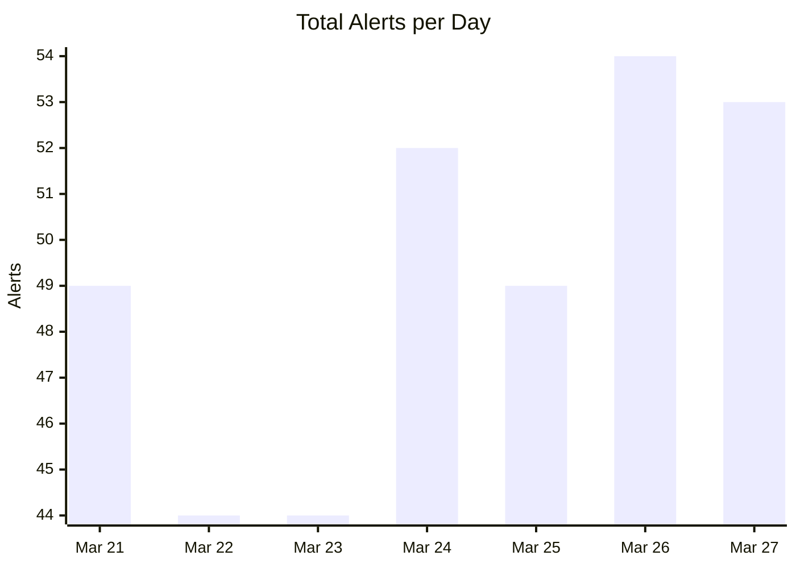
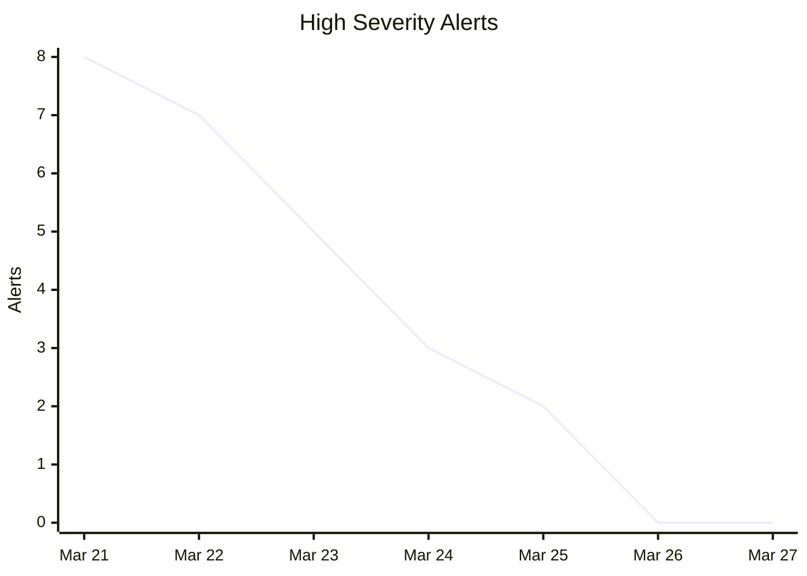
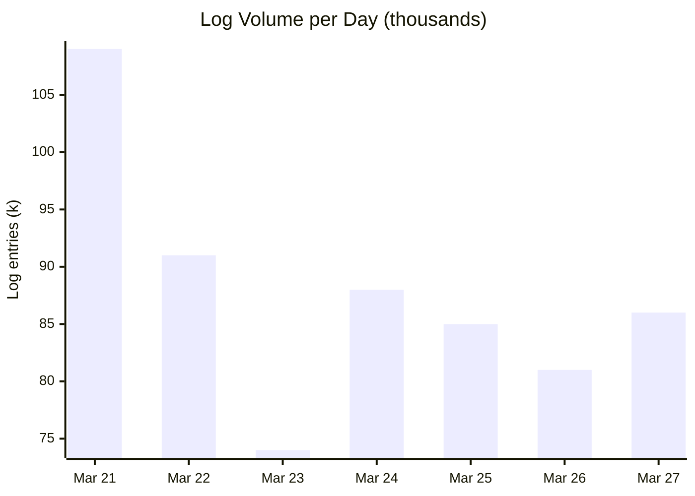
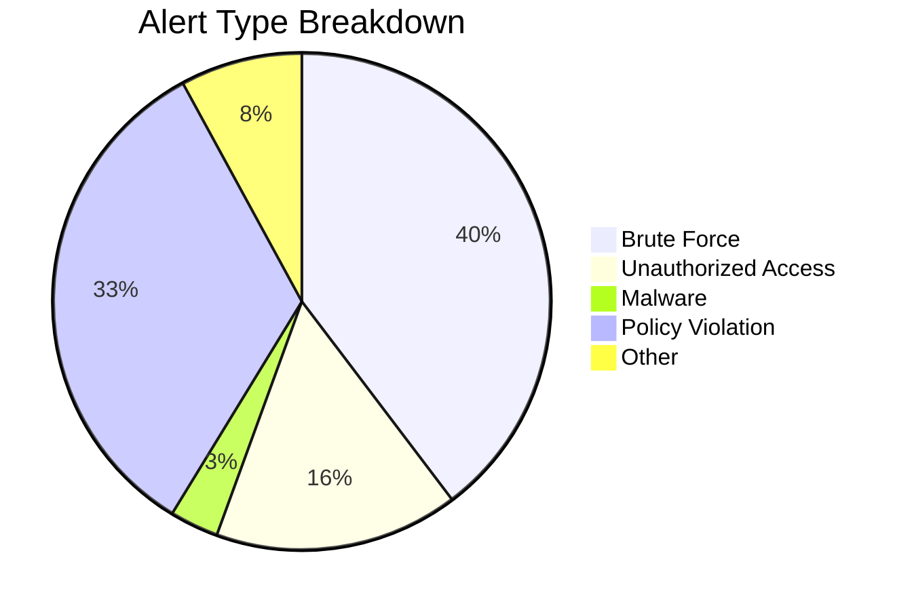
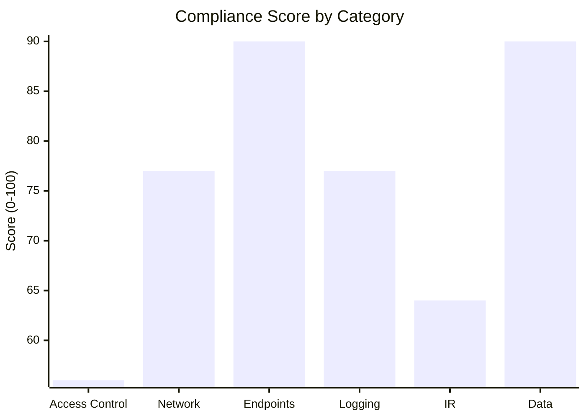
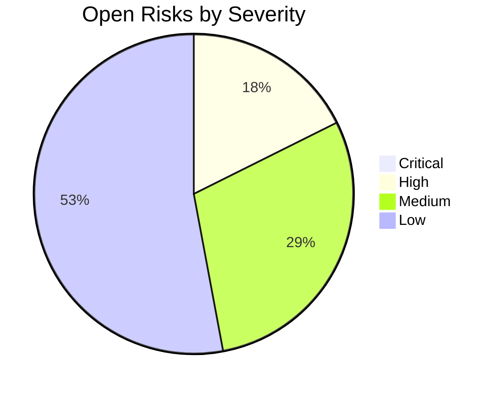

# Security Report — 2026-03-27

This report is auto-generated as part of the SOC & GRC project. It covers the last 7 days of simulated security activity.

---

## Quick summary

| Area | Value |
|------|-------|
| Total alerts (7 days) | 345 |
| High severity alerts | 25 |
| Incidents closed | 46 |
| False positives | 80 |
| Avg compliance score | 76% |
| Open risks | 34 |
| Critical risks | 0 |

---

## SOC — Alerts and Activity

### Total alerts per day

### High severity alerts

### Log volume per day

### Alert breakdown by type

---

## GRC — Compliance and Risk

### Compliance score by category

Scores are based on a self-assessment against the compliance checklist. 100 means all controls are in place.

### Open risks by severity

---

## Notes

This data is simulated for demonstration purposes. In a real environment these numbers would come from a SIEM or log aggregation tool.

The compliance scores are updated each run to reflect a changing environment. A drop in score should trigger a review of that control area.
